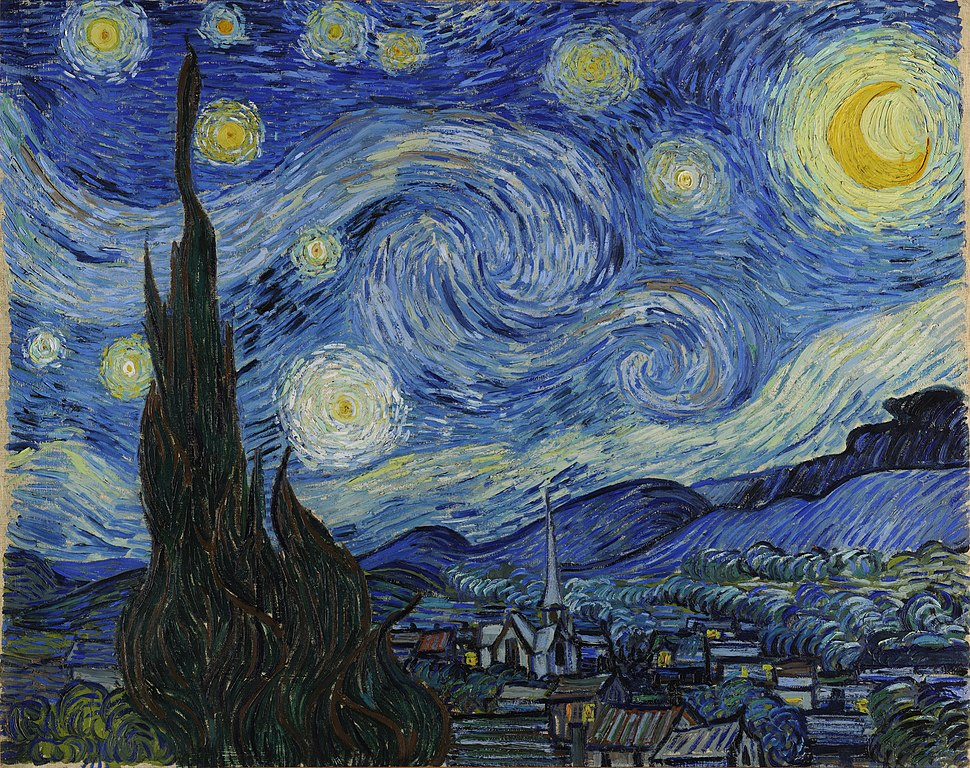
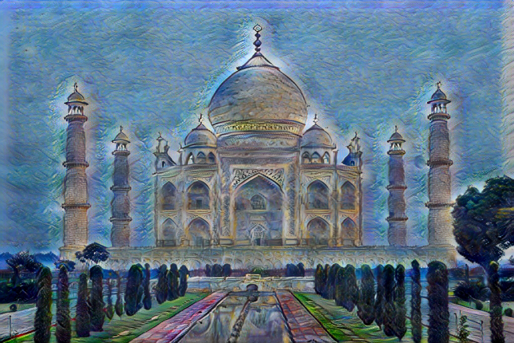
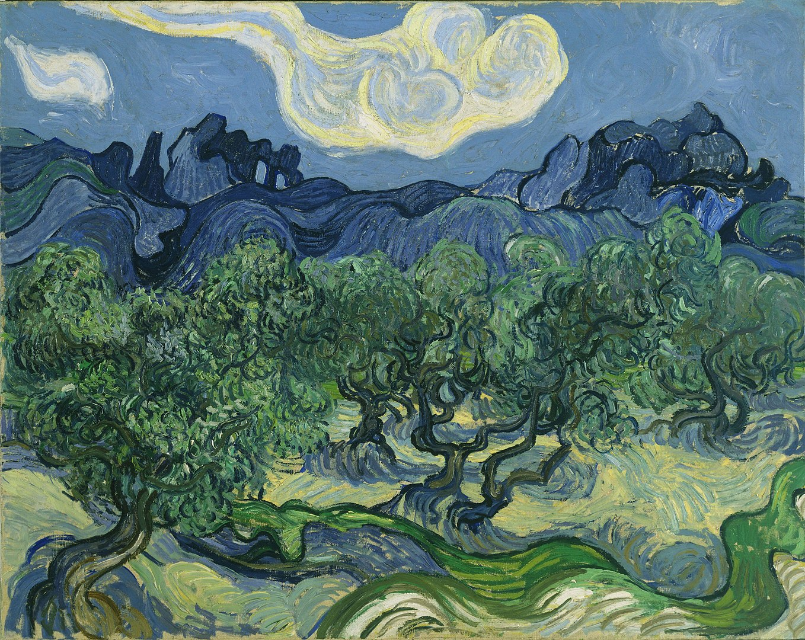
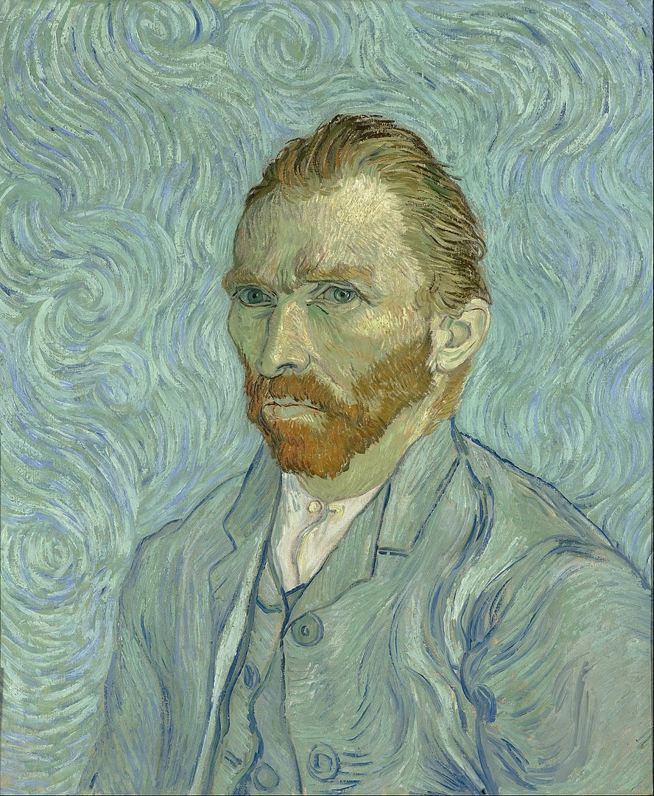

# AdaIN-pytorch
PyTorch implementation of "Arbitrary Style Transfer in Real-time with Adaptive Instance Normalization" by Xun Huang, Serge Belongie. [arxiv](https://arxiv.org/abs/1703.06868).

## 0. References
- [irasin/Pytorch_AdaIN](https://github.com/irasin/Pytorch_AdaIN/)

## 1. Set up and train model
### 1.1 install requirements
`pip install -r requitements.txt`

### 1.2 get the datasets and unzip them to desired location
- COCO: https://cocodataset.org/#download
- WikiArt: https://www.kaggle.com/c/painter-by-numbers/data

### 1.3 Train model
- to start training:
    `python main.py train path/to/coco path/to/wikiart [OPTIONS]`

- to change training parameters and options:
  `python main.py train --help`

## 2. Style Transfer using pre-trained model
- to run inference:
    `python main.py infer [OPTIONS]`
- info on supported options:
  `python main.py infer --help`

## 3. Some Results
- All images were resized to 1024x1024 for inference. The 1024x1024 outputs are interpolated to the original size using bilinear interpolation.

| Content Img   |      Style Img      |  Output |
|----------|:-------------:|------:|
|  |   |  |
|  |   |  |
|  |   |  |
